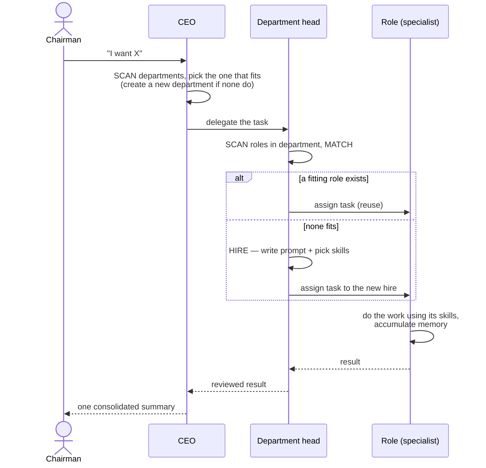

# Orchestra

> Chat with an AI company, not a chatbot.

Orchestra is a chat interface where a team of specialized AI agents works
together like a real company. You talk to one person — the **CEO** — and the
rest of the organization handles the work behind the scenes.

You are the **Chairman**. You set the direction; the company executes.

---

## Table of contents

- [The idea](#the-idea)
- [Core concepts](#core-concepts)
- [How a request flows](#how-a-request-flows)
- [The hiring model](#the-hiring-model)
- [The roster](#the-roster)
  - [Seed roster (ships in the box)](#seed-roster-ships-in-the-box)
  - [Knowledge catalog (what it can hire)](#knowledge-catalog-what-it-can-hire)
- [Architecture](#architecture)
- [Tech stack](#tech-stack)
- [Data model](#data-model)
- [Project structure](#project-structure)
- [Getting started](#getting-started)
- [Roadmap](#roadmap)
- [Status](#status)
- [Contributing](#contributing)
- [License](#license)

---

## The idea

A single AI agent that spawns helpers and tears them down loses context between
every task. Orchestra keeps a **stable org chart**: persistent roles accumulate
context, the CEO owns the conversation with you, and you stay focused on *what
you want* — not on micromanaging *who does it*.

```
  Chairman (you)  ⇄  CEO  ──▶  delegates to the right department
                      ▲
                      └──────  collects results, summarizes, reports back
```

- **You talk to the CEO only.** Tell the CEO what you want. They take it from there.
- **The CEO delegates and reports.** Work is routed to the relevant department;
  you get one consolidated summary back instead of noise from every agent.
- **Agents are persistent roles, not disposable tasks.** Each agent holds a
  position with its own skill set and stays on the team waiting for work — they
  are not spawned for a single task and discarded afterward.
- **Coverage is unbounded.** Orchestra does not ship a fixed list of experts. It
  ships a small seed team and **hires new specialists on demand** when a request
  needs expertise nobody on the team has yet. New hires stay on the team.

---

## Core concepts

| Concept | What it is |
| --- | --- |
| **Chairman** | You. The human. The only one the CEO talks to. Sets direction. |
| **CEO** | The single entry point. Plans, routes work to departments, consolidates results, reports back. The only agent with no boss but you. |
| **Department** | A stable bucket of related expertise (Engineering, Finance, Creative…). Each has one **head**. Created by the CEO when no existing department fits. |
| **Department head** | Leads a department. Routes work to roles inside it and **hires new roles** when none fit. |
| **Role** | A specialist position — defined entirely by a **system prompt + a list of skills**. Persistent. This is the unit that gets hired. |
| **Skill** | An atomic capability a role can use (web search, write code, generate image…). The only unit **humans** create; agents never mint skills. |

### Two things both called "role"

A common confusion worth heading off early:

- **Role definition** — `id` + one-line `description` + `system_prompt` +
  `skills[]`. Tiny text. Permanent. *This is what gets hired* and stored on disk.
- **Role memory** — the context a role accumulates while doing real work. Grows
  over time. Loaded only when the role is active; pruned when stale.

Having 500 role *definitions* is cheap — they are just text sitting dormant. Only
*memory* costs resources, and only for active roles. This separation is what lets
the roster grow without bound while the running system stays lean.

---

## How a request flows



1. **Chairman → CEO.** You send a message. The CEO is the only entry point.
2. **CEO routes to a department.** It scans the ~6–20 departments, matches the
   request, and delegates to that department's head. If nothing fits, it creates
   a new department (with a head) first.
3. **Head routes to a role.** The head scans the roles in its department. If one
   can do the job, it reuses it. If not, it **hires** a new role.
4. **Role executes.** The specialist does the work using its skills (tools) and
   accumulates memory for next time.
5. **Results bubble up.** Head reviews → CEO consolidates → you get **one**
   summary, not a transcript of internal chatter.

---

## The hiring model

Orchestra grows its org chart on demand without bloating. The full protocol
lives in [`HIRING.md`](./HIRING.md); the essentials:

### Who can create what

| Actor | Can create | Cannot create |
| --- | --- | --- |
| **Chairman / devs** | **Skills** (new atomic capabilities) | — |
| **CEO** | **Departments** | Skills |
| **Department head** | **Roles** inside their own department | Skills, departments |

Skills are the atomic unit and are created **only by humans**. Roles and
departments are just text (a prompt + a list of *existing* skills), so agents can
mint them safely. Skills are real capabilities — if agents could self-mint them,
near-duplicate skills would explode the same way uncontrolled roles would.

### The hire protocol (run by a department head)

```
Head receives a task from the CEO:
  1. SCAN   read the one-line description of every role in the department
  2. MATCH  can an existing role do this?
              ├─ yes → reuse it (STOP)
              └─ no  → continue
  3. HIRE   write { id, department, description, system_prompt, skills[] }
              - description: one sharp line — all future MATCH steps see only this
              - skills: pick only from the existing skill registry
              - if a needed skill doesn't exist, STOP and ask the Chairman
  4. APPEND add the role to orchestra.json, then assign the task to it
  5. LOG    tell the Chairman: "Hired '<id>' into <department>"
```

The CEO runs the same loop one level up over **departments**.

### Why no automatic firing

Role definitions never auto-expire — they are tiny text and cost nothing while
dormant. When the roster feels crowded or duplicated, the Chairman runs a manual
review: list roles whose descriptions overlap, merge or delete by hand. A human
glance is cheaper than the machinery to automate it.

---

## The roster

There are **two layers** to the roster, and it is important not to confuse them.

### Seed roster (ships in the box)

The system ships with a **small** team — just enough to bootstrap. Everything
else is hired on demand. Seed roster: **6 departments, 11 roles**
(defined in [`orchestra.json`](./orchestra.json)).

| Department | Head | Roles |
| --- | --- | --- |
| **Executive** | CEO | CEO |
| **Engineering** | Tech Lead | Tech Lead, Developer |
| **Product & Design** | UX/UI Designer | UX/UI Designer |
| **Creative** | Art Director | Art Director, Graphic Designer, Manga Writer, Illustrator |
| **Finance** | Finance Expert | Finance Expert, Economist |
| **Esoteric** | Fortune Teller | Fortune Teller |

> A deliberately tiny seed is the point. Shipping hundreds of pre-built roles
> would contradict the on-demand model — most would sit idle, and the roster
> would be impossible to keep coherent.

### Knowledge catalog (what it can hire)

The seed is small, but coverage is **not** limited to it. The catalog below is
the reference map the CEO and department heads draw from when hiring — and they
are free to create roles **not** listed here when a request demands it. The
catalog is open-ended by design.

**~20 departments, 150+ reference roles** (illustrative, non-exhaustive):

<details>
<summary><b>1. Engineering &amp; Technology</b> (15)</summary>

Tech Lead · Backend Developer · Frontend Developer · Mobile Developer ·
DevOps/SRE · Security Engineer · QA/Test Engineer · Data Engineer · ML Engineer ·
Embedded/IoT Engineer · Blockchain Engineer · Game Developer · Cloud Architect ·
Database Administrator · Network Engineer
</details>

<details>
<summary><b>2. Data, AI &amp; Research</b> (7)</summary>

Data Scientist · Data Analyst · ML Researcher · Statistician · Research
Scientist · Bioinformatician · Quant Researcher
</details>

<details>
<summary><b>3. Product &amp; Design</b> (7)</summary>

Product Manager · UX/UI Designer · UX Researcher · Product Designer · Design
Systems Specialist · Service Designer · Accessibility Specialist
</details>

<details>
<summary><b>4. Creative &amp; Content</b> (14)</summary>

Art Director · Graphic Designer · Illustrator · Manga/Comic Writer · Novelist ·
Screenwriter · Copywriter · Video Editor · Motion/3D Artist · Music Composer ·
Sound Designer · Photographer · Brand Designer · Game Designer
</details>

<details>
<summary><b>5. Marketing &amp; Growth</b> (9)</summary>

Marketing Strategist · SEO Specialist · Content Marketer · Social Media Manager ·
Performance/Ads Specialist · Growth Hacker · PR Specialist · Email Marketer ·
Influencer Strategist
</details>

<details>
<summary><b>6. Sales &amp; Business Development</b> (5)</summary>

Sales Lead · Account Manager · BD Specialist · Partnership Manager · Sales
Engineer
</details>

<details>
<summary><b>7. Finance, Economics &amp; Investing</b> (11)</summary>

CFO · Accountant · Financial Analyst · Economist · Investment Advisor · Quant
Trader · Tax Specialist · Auditor · Actuary · Crypto Analyst · Real Estate
Analyst
</details>

<details>
<summary><b>8. Legal, Compliance &amp; Risk</b> (7)</summary>

Corporate Lawyer · IP/Patent Lawyer · Contract Specialist · Compliance Officer ·
Privacy/GDPR Specialist · Risk Manager · Paralegal
</details>

<details>
<summary><b>9. Operations &amp; Supply Chain</b> (7)</summary>

COO · Project Manager · Logistics Specialist · Procurement Specialist ·
Manufacturing/Process Engineer · Quality Assurance Lead · Business Analyst
</details>

<details>
<summary><b>10. People &amp; Organization (HR)</b> (6)</summary>

HR Lead · Recruiter · L&amp;D/Trainer · Comp &amp; Benefits Specialist ·
Organizational Psychologist · Career Coach
</details>

<details>
<summary><b>11. Customer &amp; Support</b> (5)</summary>

Customer Success Manager · Support Specialist · Community Manager · Technical
Writer · Onboarding Specialist
</details>

<details>
<summary><b>12. Strategy &amp; Consulting</b> (5)</summary>

Management Consultant · Corporate Strategist · Innovation Lead · Competitive
Intelligence Analyst · M&amp;A Advisor
</details>

<details>
<summary><b>13. Science &amp; Engineering (physical)</b> (9)</summary>

Physicist · Chemist · Biologist · Mechanical Engineer · Electrical Engineer ·
Civil/Structural Engineer · Environmental Scientist · Materials Scientist ·
Aerospace Engineer
</details>

<details>
<summary><b>14. Health, Medicine &amp; Wellness</b> (8)</summary>

General Physician · Nutritionist/Dietitian · Fitness Trainer · Psychologist/
Therapist · Pharmacist · Mental Health Coach · Sports Medicine Specialist ·
Veterinarian
</details>

<details>
<summary><b>15. Education &amp; Knowledge</b> (6)</summary>

Teacher/Tutor · Curriculum Designer · Academic Researcher · Language Tutor · Exam
Coach · Librarian/Knowledge Manager
</details>

<details>
<summary><b>16. Humanities &amp; Social Sciences</b> (8)</summary>

Historian · Philosopher · Sociologist · Anthropologist · Political Scientist ·
Linguist · Ethicist · Geographer
</details>

<details>
<summary><b>17. Arts, Culture &amp; Entertainment</b> (8)</summary>

Film Director · Curator · Fashion Designer · Interior Designer · Architect ·
Chef/Culinary Expert · Event Planner · Travel Planner
</details>

<details>
<summary><b>18. Lifestyle &amp; Personal</b> (6)</summary>

Life Coach · Productivity Coach · Relationship Advisor · Parenting Advisor ·
Personal Stylist · Home Organizer
</details>

<details>
<summary><b>19. Esoteric &amp; Spiritual</b> (7)</summary>

Fortune Teller · Astrologer · Tarot Reader · Numerologist · Feng Shui Consultant ·
Meditation/Mindfulness Guide · Dream Interpreter
</details>

<details>
<summary><b>20. Trades &amp; Practical</b> (5)</summary>

Real Estate Agent · Auto Mechanic Advisor · Gardening/Horticulture Expert · DIY/
Handyman Advisor · Pet Care Specialist
</details>

> **Counts:** 15 + 7 + 7 + 14 + 9 + 5 + 11 + 7 + 7 + 6 + 5 + 5 + 9 + 8 + 6 + 8 +
> 8 + 6 + 7 + 5 = **155 reference roles** across **20 departments**. This is a
> map, not a cap — the hire protocol can create roles outside it.

---

## Architecture

Orchestra is a **two-layer hierarchy** over the Codex SDK. The mapping is
deliberately 1:1 so almost no orchestration has to be hand-written:

| Orchestra concept | Maps to (Codex SDK) |
| --- | --- |
| CEO | The top-level agent loop / session |
| Department head & role | A **Codex agent instance** with a system prompt and a tool allowlist |
| Skill | A **tool** the agent is allowed to call |
| Role definition | Data in `orchestra.json` → loaded to configure an agent instance |
| Role memory | A per-role memory file loaded into that agent's context |

```
┌──────────────────────────────────────────────────────────────┐
│  Chat UI  (React + Vite)                                      │
│    └── one conversation, with the CEO                         │
└───────────────────────────────┬──────────────────────────────┘
                                 │  HTTP / stream
┌───────────────────────────────▼──────────────────────────────┐
│  Orchestra server  (Node + TypeScript)                        │
│                                                               │
│   CEO loop ──┬─ routes to ─▶ Department head (subagent)       │
│              │                     │                          │
│              │                     └─ routes/hires ─▶ Role    │
│              │                                  (subagent)    │
│              │                                     │          │
│              │              skills = tools  ◀──────┘          │
│              │                                               │
│   Hire protocol ── reads/writes ─▶ orchestra.json            │
│   Role memory   ── reads/writes ─▶ memory/<role-id>.md       │
└───────────────────────────────┬──────────────────────────────┘
                                 │
                    ┌────────────▼───────────┐
                    │  OpenAI models (Codex)   │
                    │  stronger → CEO + heads  │
                    │  faster   → workers      │
                    └─────────────────────────┘
```

**Design principles**

- **Hierarchy beats a flat roster.** The CEO chooses among ~20 departments, not
  ~150 roles. Routing is `O(departments)` then `O(roles-in-one-department)`,
  never `O(everyone)`. This is the whole reason coverage can grow without the
  routing problem blowing up.
- **Definitions are data, not code.** Adding a specialist is appending JSON, not
  writing a class. The system can do it to itself at runtime.
- **Files are the database — until they aren't.** Roster and memory are plain
  files. No database is introduced until file storage measurably hurts.
- **Tiered models for cost.** Reasoning-heavy orchestration (CEO, heads) uses the
  strongest model; routine worker roles use cheaper, faster models.

---

## Tech stack

| Layer | Choice | Why |
| --- | --- | --- |
| **Language** | TypeScript (Node.js ≥ 20) | First-class Codex SDK support; one language across server and UI. |
| **Agent runtime** | Codex SDK | The agent loop and tools map 1:1 to role / skill / CEO. No custom orchestration engine to build or maintain. |
| **Models** | OpenAI models via Codex — a stronger model for CEO & heads, a faster/cheaper one for worker roles | Match model cost to the reasoning each role actually needs. |
| **Storage** | Flat files — `orchestra.json` (roster) + `memory/<role>.md` (per-role memory) | Zero infra. The roster is small structured data; memory is append-friendly text. |
| **Frontend** | React + Vite, single-page chat | One conversation with the CEO. A chat box does not need a heavy framework. |
| **Roster validation** | `validate.py` (zero-dependency Python) | A standalone integrity check, runnable in any CI without the Node toolchain. |

### Deliberately **not** in the stack (yet)

Every line here is complexity we chose to skip until something forces it:

- **No database.** Files until file storage hurts.
- **No vector DB / embeddings for hiring.** The `MATCH` step is a linear scan of
  one-line role descriptions. Add embedding search only when a single department
  passes ~100 roles.
- **No auth / multi-tenant / accounts.** It is a single-Chairman tool.
- **No message queue or microservices.** One server process.
- **No automatic firing / TTL logic.** Manual roster review instead.
- **No state-management library on the frontend.** One conversation is local state.

> If you need one of these, the README is wrong for your use case — open an issue
> and say so. The defaults optimize for the smallest thing that works.

---

## Data model

### `orchestra.json`

The single source of truth for the org chart.

```jsonc
{
  "skills": [
    { "id": "web-search", "description": "Search the web and read sources" }
    // …atomic capabilities; created by humans only
  ],
  "departments": [
    { "id": "engineering", "head": "tech-lead", "description": "…" }
    // …head must be a role that lives in this department
  ],
  "roles": [
    {
      "id": "developer",
      "department": "engineering",
      "description": "Implements software",     // the one line MATCH reads
      "system_prompt": "You are a Developer…",   // defines the subagent
      "skills": ["write-code", "run-tests"],     // must exist in the registry
      "created_by": "seed"                        // or the head that hired it
    }
  ]
}
```

### Per-role memory

`memory/<role-id>.md` — free-form context a role accumulates. Loaded only when
that role is active. Not yet in the repo; created at runtime.

### Validation

`validate.py` enforces the invariants the hire protocol depends on:

- every role's `department` exists;
- every department's `head` is a real role **that lives in that department**;
- every `skill` a role references exists in the registry;
- all ids are unique.

```bash
python3 validate.py
# OK: 6 departments, 11 roles, 12 skills
```

Run it after any roster edit — including edits an agent makes at runtime.

---

## Project structure

```
orchestra/
├── README.md          ← you are here
├── HIRING.md          ← the full hiring protocol
├── orchestra.json     ← the org chart: skills, departments, roles (seed)
├── validate.py        ← roster integrity check
└── (planned)
    ├── src/           ← TypeScript server + Codex SDK wiring
    ├── web/           ← React + Vite chat UI
    └── memory/        ← per-role memory files, created at runtime
```

---

## Getting started

> **Heads up:** Orchestra is early-stage. The roster, hiring protocol, and
> validator are real and runnable today; the server and UI are not yet
> implemented. What works now:

```bash
# Validate the seed org chart
python3 validate.py
```

The runtime (`src/`, `web/`) is the next milestone — see the roadmap.

---

## Roadmap

- [x] Org-chart data model (`orchestra.json`)
- [x] Hiring protocol (`HIRING.md`)
- [x] Roster validator (`validate.py`)
- [ ] CEO loop + department/role agents on the Codex SDK
- [ ] Skill → tool wiring for the seed skills
- [ ] On-demand hiring that appends to `orchestra.json` at runtime
- [ ] Per-role memory persistence
- [ ] React + Vite chat UI
- [ ] Roster-review command for manual consolidation

---

## Status

Early stage. This document describes the project's goal, design, and intended
architecture; the agent runtime is in progress. Interfaces and roster are
expected to change.

---

## Contributing

Issues and pull requests are welcome. Because the project is still taking shape,
opening an issue to discuss larger changes first is appreciated. If you add or
edit roles, run `python3 validate.py` before opening a PR.

---

## License

To be announced.
